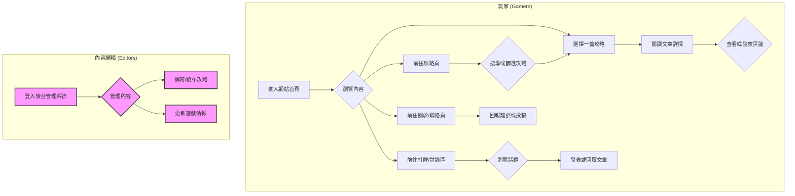

```mermaid
graph TD
    subgraph "玩家 (Gamers)"
        A[進入網站首頁] --> B{瀏覽內容};
        B --> C[點擊熱門攻略或最新新聞];
        B --> D[前往攻略頁];
        B --> E[前往社群/討論區];
        B --> F[前往關於/聯絡頁];

        D --> G{搜尋或篩選攻略};
        G --> C[選擇一篇攻略];
        
        C --> H[閱讀文章詳情];
        H --> I{查看或發表評論};

        E --> J{瀏覽話題};
        J --> K[發表或回覆文章];

        F --> L[回報錯誤或投稿];
    end

    subgraph "內容編輯 (Editors)"
        M[登入後台管理系統] --> N{管理內容};
        N --> O[撰寫/發布攻略];
        N --> P[更新遊戲情報];
    end

    style M fill:#f9f,stroke:#333,stroke-width:2px
    style N fill:#f9f,stroke:#333,stroke-width:2px
    style O fill:#f9f,stroke:#333,stroke-width:2px
    style P fill:#f9f,stroke:#333,stroke-width:2px

```