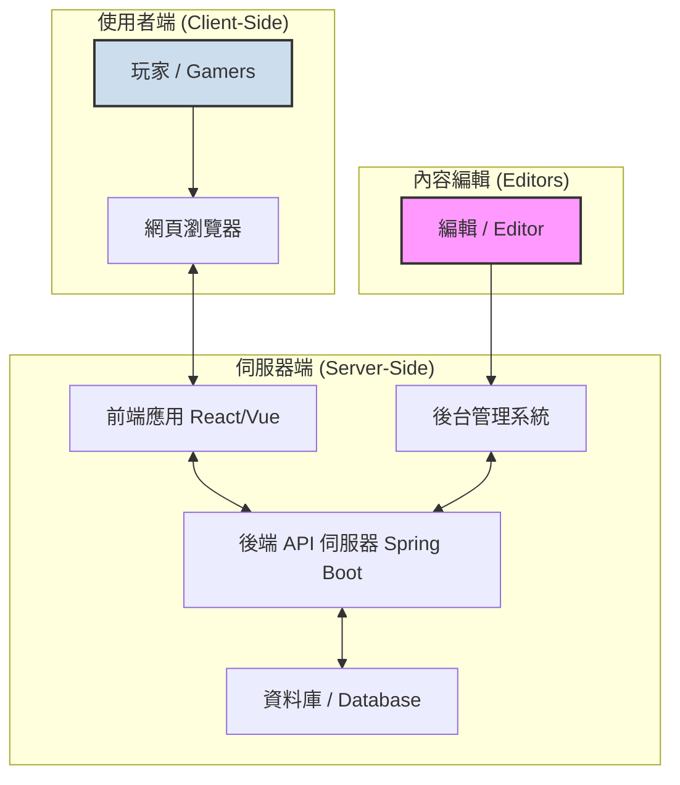
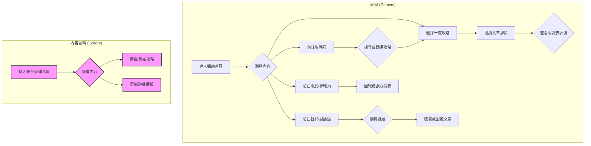

# 系統架構設計 (System Architecture)

本文檔基於 `REQ.md` 的需求，定義了「遊戲攻略與社群網站」的技術架構、資料庫結構與 API 設計。

## 1. 系統架構圖 (System Architecture Diagram)

本專案採用前後端分離的現代 Web 應用架構。

- **前端 (Frontend)**：一個單頁應用程式 (SPA)，負責使用者介面與互動。
- **後端 (Backend)**：提供 RESTful API，處理業務邏輯與資料存取。
- **資料庫 (Database)**：儲存所有網站內容，如文章、留言等。
- **後台管理系統 (Admin Panel)**：一個獨立的介面，供內容編輯者管理文章與情報（此部分為後台功能，不在主要使用者網站範圍內）。



## 2. 技術選型 (Technology Stack)

- **後端 (Backend)**: **Spring Boot (Java)**
  - 理由：基於現有的 `build.gradle` 專案結構，使用 Spring Boot 能快速開發穩定且高效能的 RESTful API。
- **前端 (Frontend)**: **React**
  - 理由：React 是目前最流行的前端框架之一，擁有龐大的社群與豐富的生態系，適合建構互動性高的單頁應用程式。
- **資料庫 (Database)**: **PostgreSQL**
  - 理由：功能強大且穩定的開源關聯式資料庫，足以應付文章、分類與留言等結構化資料。
- **部署 (Deployment)**: **Docker**
  - 理由：將前後端應用程式容器化，簡化開發、測試與部署流程。

## 3. 資料庫結構設計 (Database Schema Design)

以下是核心功能的資料庫表結構設計。

```sql
-- 攻略/新聞文章 (Articles for guides/news)
CREATE TABLE articles (
    id SERIAL PRIMARY KEY,
    title VARCHAR(255) NOT NULL,
    content TEXT NOT NULL,
    author VARCHAR(100),
    category_id INT,
    created_at TIMESTAMP WITH TIME ZONE DEFAULT CURRENT_TIMESTAMP,
    updated_at TIMESTAMP WITH TIME ZONE DEFAULT CURRENT_TIMESTAMP,
    FOREIGN KEY (category_id) REFERENCES categories(id)
);

-- 文章分類 (Categories for articles, e.g., by game title)
CREATE TABLE categories (
    id SERIAL PRIMARY KEY,
    name VARCHAR(100) NOT NULL UNIQUE,
    description VARCHAR(255)
);

-- 留言/評論 (Comments on articles)
CREATE TABLE comments (
    id SERIAL PRIMARY KEY,
    article_id INT NOT NULL,
    author_name VARCHAR(100) DEFAULT '匿名', -- Anonymous comments as per REQ
    body TEXT NOT NULL,
    created_at TIMESTAMP WITH TIME ZONE DEFAULT CURRENT_TIMESTAMP,
    FOREIGN KEY (article_id) REFERENCES articles(id)
);

-- 聯絡表單提交 (Contact form submissions)
CREATE TABLE contact_submissions (
    id SERIAL PRIMARY KEY,
    email VARCHAR(255),
    subject VARCHAR(255),
    message TEXT NOT NULL,
    submitted_at TIMESTAMP WITH TIME ZONE DEFAULT CURRENT_TIMESTAMP
);
```

## 4. API 端點設計 (API Endpoint Design)

後端將提供以下 RESTful API 供前端呼叫。

- **攻略/新聞 (Articles)**
  - `GET /api/articles`: 取得所有文章列表，支援分頁與篩選（如 `?category=...&search=...`）。
  - `GET /api/articles/{id}`: 取得單篇文章的詳細內容。
  - `GET /api/categories`: 取得所有文章分類。

- **評論 (Comments)**
  - `GET /api/articles/{article_id}/comments`: 取得特定文章的所有評論。
  - `POST /api/articles/{article_id}/comments`: 在特定文章下新增一則匿名評論。

- **聯絡 (Contact)**
  - `POST /api/contact`: 提交聯絡表單。

## 5. 資料流程圖 (Data Flow Diagram)

此圖表展示了不同角色在網站上的主要操作流程。


