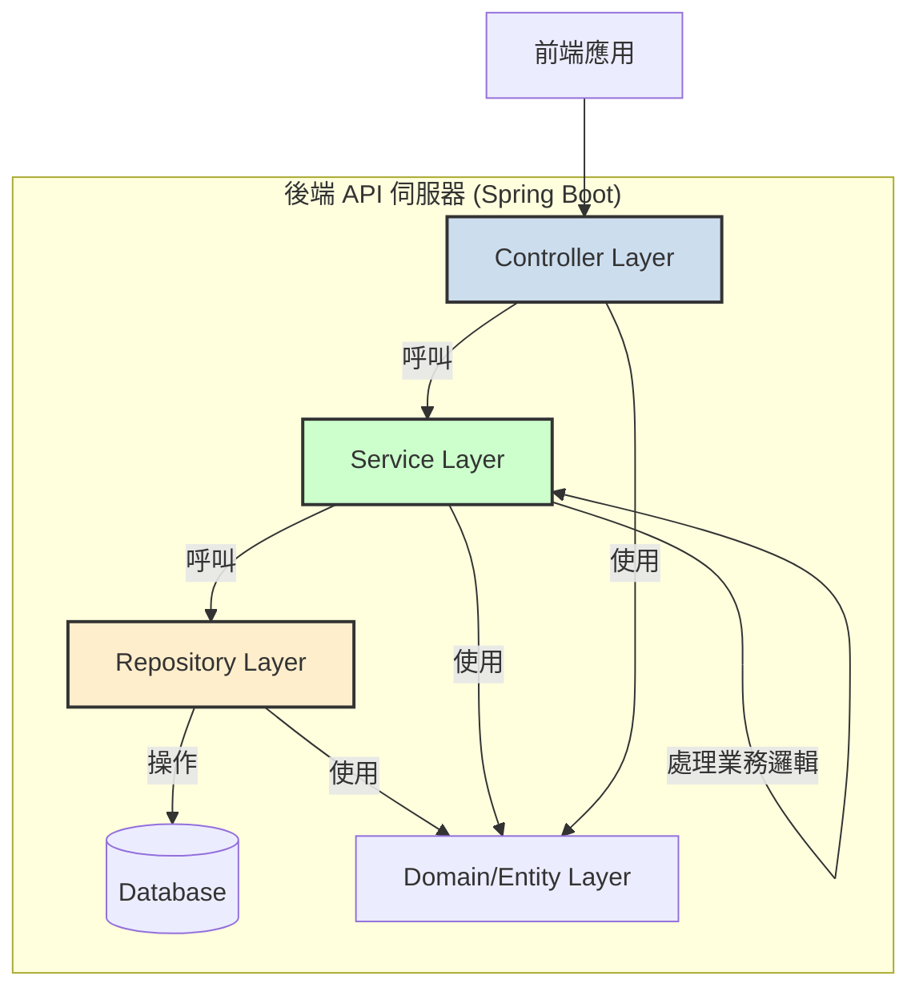

# 系統設計 (System Design)

本文檔基於 `SA.md` 的系統架構，進一步闡述後端應用的內部模組設計、職責劃分以及資料庫與程式碼之間的對應關係。

## 1. 後端系統設計圖 (Backend System Design Diagram)

後端應用採用經典的分層架構，確保職責分離、可維護性與可測試性。

- **Controller Layer**: 接收來自前端的 HTTP 請求，驗證輸入並呼叫對應的 Service。
- **Service Layer**: 包含核心業務邏輯，處理資料的組合、計算與轉換。
- **Repository Layer**: 負責與資料庫進行互動，執行 CRUD (Create, Read, Update, Delete) 操作。
- **Domain / Entity Layer**: 定義資料模型，對應到資料庫中的資料表。

## 2. 後端模組職責 (Backend Module Responsibilities)

根據功能需求，後端系統可劃分為以下幾個核心模組：

### Article (文章) 模組
- **職責**: 管理攻略與新聞文章的查詢。
- **主要類別**:
  - `ArticleController.java`:
    - `GET /api/articles`: 處理文章列表查詢，支援分類、搜尋等篩選條件。
    - `GET /api/articles/{id}`: 處理單篇文章的查詢。
  - `ArticleService.java`: 執行查找文章的業務邏輯。
  - `ArticleRepository.java`: 繼承 Spring Data JPA 的 `JpaRepository`，提供對 `articles` 表的資料庫操作。

### Category (分類) 模組
- **職責**: 管理文章分類的查詢。
- **主要類別**:
  - `CategoryController.java`:
    - `GET /api/categories`: 處理所有分類的查詢。
  - `CategoryService.java`: 執行查找分類的業務邏輯。
  - `CategoryRepository.java`: 提供對 `categories` 表的資料庫操作。

### Comment (評論) 模組
- **職責**: 管理文章下的評論查詢與新增。
- **主要類別**:
  - `CommentController.java`:
    - `GET /api/articles/{article_id}/comments`: 處理特定文章的評論列表查詢。
    - `POST /api/articles/{article_id}/comments`: 處理新增評論的請求。
  - `CommentService.java`: 執行評論的查詢與儲存邏輯。
  - `CommentRepository.java`: 提供對 `comments` 表的資料庫操作。

### Contact (聯絡) 模組
- **職責**: 處理聯絡表單的提交。
- **主要類別**:
  - `ContactController.java`:
    - `POST /api/contact`: 處理聯絡表單的提交請求。
  - `ContactService.java`: 執行儲存聯-絡資訊的業務邏輯（未來可擴充寄送通知信等功能）。
  - `ContactRepository.java`: 提供對 `contact_submissions` 表的資料庫操作。

## 3. 資料表與類別對應 (Table-Class Mapping)

使用 JPA (Java Persistence API) 將資料庫中的資料表映射為 Java 的實體類別 (Entity)。

| 資料庫資料表 (Table) | Java 實體類別 (Entity Class) | 說明 |
| :--------------------- | :--------------------------- | :--- |
| `articles`             | `Article.java`               | 儲存文章的標題、內容、作者等資訊。 |
| `categories`           | `Category.java`              | 儲存文章分類的名稱與描述。 |
| `comments`             | `Comment.java`               | 儲存與文章關聯的評論內容。 |
| `contact_submissions`  | `ContactSubmission.java`     | 儲存來自聯絡表單的提交內容。 |

這些實體類別將位於 `org.example.domain` 或 `org.example.entity` 套件路徑下，並使用 `@Entity`、`@Table`、`@Id` 等 JPA 註解進行標記。